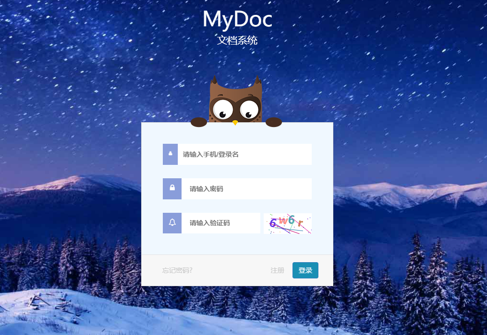
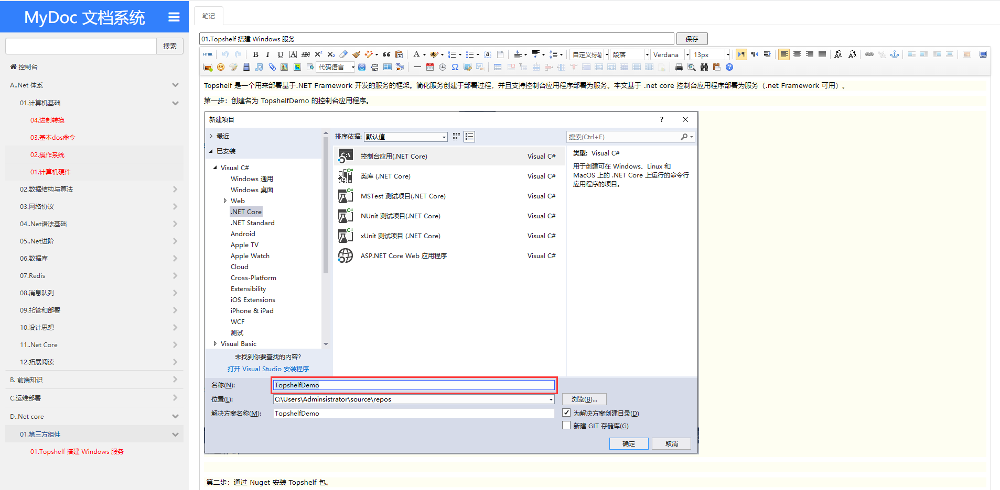

# MyDoc
文档信息、笔记管理  
ASP.NET Core 3.1 + EF Core + UEditor + JQuery  
用于个人在线文档，包含登录、笔记本管理、笔记添加、修改、删除等功能  

### 预览
> 演示环境：
  Web：[http://120.25.76.97:83/](http://120.25.76.97:83/) （账号：test 密码：123456）  或者自行注册，邀请码:MyDoc  
  环境：CentOs + docker + mysql  
  配置：单核、2G内存、1M带宽  
  

### 项目构建
1. 准备一个mysql数据库，使用[Bruke.EntityFrameWork]项目下面sql,创建一个数据库。
2. 修改[MyDoc]项目下,appsettings.Development.json中的连接字符串(参考appsettings.Example.json)。 **[必须]**

### 知识点
> * [ASP.NET Core入门](https://docs.microsoft.com/zh-cn/aspnet/core/getting-started/?view=aspnetcore-2.2&tabs=windows)  
ASP.NET Core入门必备。
> * [EF Core入门](https://docs.microsoft.com/zh-cn/ef/core/get-started/)  
搭配上ASP.NET Core入门，这两个文档涵盖了项目中所有的知识点：面向接口编程，依赖注入，异步编程等。
> * [AutoMapper](https://automapper.readthedocs.io/en/latest/)  
对象的映射工具。
> * [Pomelo.EntityFrameworkCore.MySql](https://github.com/PomeloFoundation/Pomelo.EntityFrameworkCore.MySql)  
EF Core的MySQL提供程序。
> * [Docker](https://docs.docker.com/)
Docker 更快捷发布

### 一些截图
  
  

### 特别感谢
> * 感谢 [小飞象](https://gitee.com/yfq2010/login-register-html)漂亮好用的登录注册界面
> * 感谢[暮光：城中城](https://gitee.com/zyplayer/swagger-mg-ui?_from=gitee_search)漂亮好用的树型目录

### 后期计划：
> * 使用EF Code First 无需使用sql进行创建数据库
> * ASP.Net 3.1 升级为 .Net 5
> * 项目镜像打包到阿里镜像仓库，一句docker pull,docker run 即可搭建MyDoc
